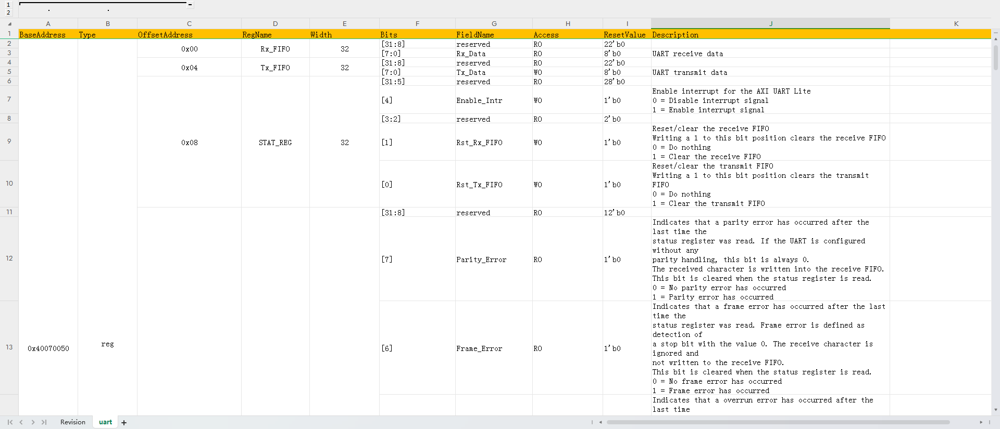

# excel2ralf
a python script which is used for transforming register Excel file into ralf file. 

## install dependence
pip install -r requirePackage.txt

## usage
generate module level ralf file
```
python main.py -f .\example\mate_project_router_module_reg_spec.xlsx -o .
```

generate system level ralf file
```
python main.py -s -d .\example -o .
```

## register Excel layout


## usage detail
https://github.com/LitchiKnight/UVM_register_model_best_practice.git
