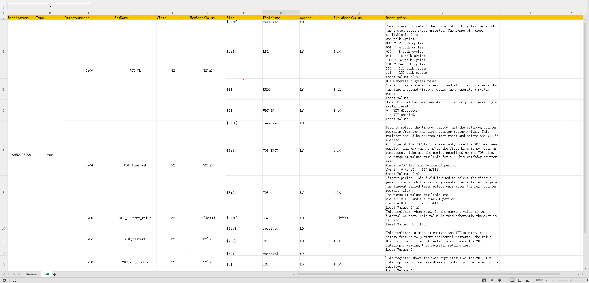

# excel2ralf
a python script which is used for transforming register Excel file into ralf file. 

## dependence
xlrd == 1.2.0

## usage
module level
```
python main.py -f .\example\mate_project_router_module_reg_spec.xlsx -o .
```

system level
```
python main.py -s -d .\example -o .
```

## register Excel layout

